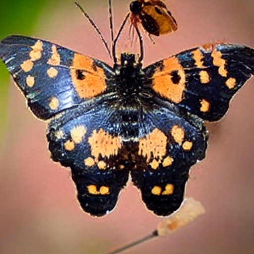

                    
                    

                        
                        

                            

                                <button onclick="previousReasoningExample()" class="nav-button">←</button>
                                Example 1/2
                                <button onclick="nextReasoningExample()" class="nav-button">→</button>
                            

                        
                            

                                <!-- Original Butterfly Example -->
                                

                                    

                                        "Generate an image of the animal resulting from a monarch caterpillar's metamorphosis"
                                    

                        
                                    

                                        
                                    

                                    
                                    

                                        
Model's Implicit Reasoning Process

                                        

                                            
1

                                            

                                            
2

                                            

                                            
3

                                        

                                        
                                        

                                            

                                                
Initial Understanding

                                                
Identifies the starting point: monarch caterpillar

                                            

                                            

                                                
Process Knowledge

                                                
Applies understanding of metamorphosis lifecycle

                                            

                                            

                                                
Final Transformation

                                                
Determines the end result: monarch butterfly

                                            

                                        

                                    

                                

                        
                                <!-- New American Flag Example -->
                                

                                    

                                        "Generate an image of the national flag of the country where Yellowstone National Park is located"
                                    

                        
                                    

                                        
                                    

                                    
                                    

                                        
Model's Implicit Reasoning Process

                                        

                                            
1

                                            

                                            
2

                                            

                                            
3

                                        

                                        
                                        

                                            

                                                
Geographic Knowledge

                                                
Locates Yellowstone National Park

                                            

                                            

                                                
Country Identification

                                                
Recognizes Yellowstone is in United States

                                            

                                            

                                                
Symbol Generation

                                                
Generates the American flag based on national symbol knowledge

                                            

                                        

                                    

                                

                            

                        

                        
                        
                            

                    